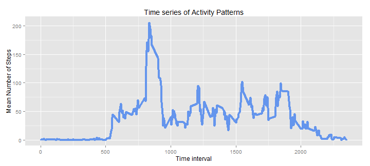
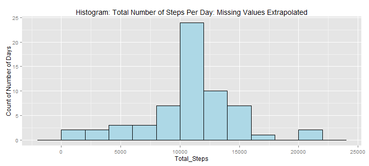
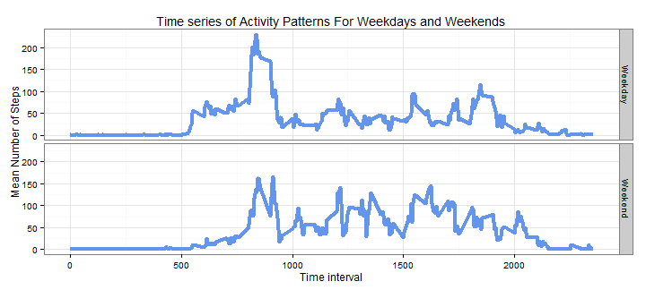

Reproducible Research:  Assignment 1
======================================================================================================================

##Introduction

There are a number of activity monitoring devices (e.g. Nike Fuelband, Jawbone Up and Fitbit) currently on the  market.  These devises are aimed at providing people with a means of recording personal movement.  Activity monitoring devices are widely used for a diversity of reasons.  These devices record a huge amount of data which could be of great benefit to many research disciplines but currently the data is under-utilised due to difficulties in obtaining and processing the raw data and ultimately in interpreting the results.   This assignment aims to outline a process to clarify means of processing, analysing and displaying results.  The current report utilises activity data collected over a period of two months (i.e. October and November 2012) from one such activity monitor.  The raw data contains the total number of steps taken at 5 minute intervals.  

##Methods

###Accessing and exploring the data.

The raw data were downloaded from the [weblink](https://d396qusza40orc.cloudfront.net/repdata%2Fdata%2Factivity.zip) on 14/09/2015 at 15.28 hrs and stored in the working directory given file name: activity.csv.


The data is read into R and the data structure is explored.  


```r
rm(list=ls())
ACT<-read.csv("activity.csv", na.strings="NA")
str(ACT)
```

```
## 'data.frame':	17568 obs. of  3 variables:
##  $ steps   : int  NA NA NA NA NA NA NA NA NA NA ...
##  $ date    : Factor w/ 61 levels "2012-10-01","2012-10-02",..: 1 1 1 1 1 1 1 1 1 1 ...
##  $ interval: int  0 5 10 15 20 25 30 35 40 45 ...
```

```r
summary(ACT)
```

```
##      steps                date          interval     
##  Min.   :  0.00   2012-10-01:  288   Min.   :   0.0  
##  1st Qu.:  0.00   2012-10-02:  288   1st Qu.: 588.8  
##  Median :  0.00   2012-10-03:  288   Median :1177.5  
##  Mean   : 37.38   2012-10-04:  288   Mean   :1177.5  
##  3rd Qu.: 12.00   2012-10-05:  288   3rd Qu.:1766.2  
##  Max.   :806.00   2012-10-06:  288   Max.   :2355.0  
##  NA's   :2304     (Other)   :15840
```

The Columns in this dataset are:

* steps: Number of steps taking in a 5-minute interval
* date: The date on which the measurement was taken  in YYYY-MM-DD format
* interval: Identifier for the 5-minute interval in which the measurement was taken


###Formatting the data.  

The date column (i.e Column 2) is converted from a factor to a date using:


```r
ACT$date = as.Date(ACT$date)
```


###Loading packages

The following packages are required for this analyses and should be installed from CRAN prior to commencing:

1) dplyr - to assist with summarising the data
2) magrittr - to enable the pipe command (i.e. %>%) to be used in dplyr
3) ggplot2 - to create graphs of the data

These packages are opened and package versions are determined. 


```r
library(dplyr)
library(ggplot2)
library(magrittr)

packageVersion("dplyr")
```

```
## [1] '0.4.3'
```

```r
packageVersion("ggplot2")
```

```
## [1] '1.0.1'
```

```r
packageVersion("magrittr")
```

```
## [1] '1.5'
```


##Results 

###Create summary graphs and statistics

Using the dplyr package the total number of steps taken per day is calculated as follows:


```r
SUMACT<- ACT %>%
        group_by(date) %>%
        summarize(Total_Steps = sum(steps, na.rm=TRUE))
```

This summary data is then used to create a histogram of the total number of steps taken. 


```r
ggplot(SUMACT, aes(x=Total_Steps)) +
        geom_histogram(binwidth=2000, 
        colour="black", fill="lightblue") +
        ylab("Count of Number of Days") +
        ggtitle("Histogram of Total Number of Steps Per Day")
```

 


The mean and median number of steps taken per day is then calculated as follows:


```r
MeanStep<-round(mean(SUMACT$Total_Steps), digits=2)
MedianStep<-median(SUMACT$Total_Steps)
```

- The mean number of steps taken per day was **9354.23**.
- The median number of steps taken per day was **10395**.


###Exploring the average daily activity pattern

To explore the average daily activity pattern the data is meaned for each 5 minute intervale irrespective of date using the code:


```r
SUMDAY<- ACT %>%
        group_by(interval) %>%
        summarize(steps = mean(steps, na.rm=TRUE))
```


The activity pattern is explored using a time series plot where the mean number of steps per five minute time period is plotted against the specific five minute time interval.


```r
ggplot(SUMDAY, aes(x=interval, y=steps)) +
    geom_line(size=1.5, colour="cornflowerblue") + 
        ylab("Mean Number of Steps") +
        xlab("Time interval") +
        ggtitle("Time series of Activity Patterns")
```

 

The time period with the maximum activity (e.g. maximum number of steps) is determined using the code:


```r
MAX<-max(SUMDAY$steps)
MAXR<-round(max(SUMDAY$steps), digits=2)
INT<-with(SUMDAY, interval[steps==MAX])
```

- The greatest number of steps (on average) that was taken in a specific time period was **206.17**.  
- The maximum number of steps occurred in the **835** time period.

##Controlling for missing values

The summary statistics above indicated that the data on activity level (i.e. number of steps) contain many missing values.  The number of missing values is calculated as follows: 


```r
MISSING<-ACT[is.na(ACT$steps) ,]
NROW<-nrow(MISSING)
```

The total number of time intervals with missing values (i.e. the number of rows with NAs) is **2304**.

Data on the number of steps is missing throughout the original data.  To minimise effects of missing data any missing values are extrapolated from the mean values for that specific 5 minute interval. This is achieved by:


```r
NEW<-merge(ACT, SUMDAY, by="interval")
NEW$step.na.rm <- NEW$steps.x
MISS <- is.na(NEW$steps.x)
NEW$step.na.rm[MISS] <- NEW$steps.y[MISS]
NEW<-NEW[, c(1,3,5)]
```


###Comparing summary statistics: excluding verses extrapolating missing values

For each day the total number of steps is then re-calcuated using the new data set where the missing values have been replaced by the mean values (i.e. for each specific 5 minute interval). A histogram is then drawn for the total number of steps taken each day with missing values replaced.


```r
SUMNEW<- NEW %>%
        group_by(date) %>%
        summarize(Total_Steps = sum(step.na.rm))

ggplot(SUMNEW, aes(x=Total_Steps)) +
        geom_histogram(binwidth=2000, 
        colour="black", fill="lightblue") +
        #xlab("Total number of steps")
        ylab("Count of Number of Days") +
        ggtitle("Histogram: Total Number of Steps Per Day: Missing Values Extrapolated")
```

 

To determine the impact of missing values on the mean and median number of steps taken each day the mean and median are recalcuated 


```r
NEWMEAN<-as.character(round(mean(SUMNEW$Total_Steps), digits=1))
NEWMEDIAN<-as.character(round(median(SUMNEW$Total_Steps), digits=1))
```

When missing vlaues were simply removed from the analyses the mean number of steps per day was **9354.23** and the median number of steps was **10395**.

When missing values were extrapolated from the full datasets through substituting missing steps with the mean values 
the mean number of steps per day was **10766.2** and the median number of steps was **10766.2**.  

Mean and Median values based on data where missing values were simply removed were higher than values based on data where missing values were extrapolated.  When missing values were removed the Mean and Median deviated from each other. When missing values were extrapolated from the mean per sample interval summary statistics for the Mean and Median were identical.

###Comparing activity patterns between weekdays and weekends

A comparision in activity levels between weekdays and weekends was then made.  Prior to making this comparison a new factor had to be created to identify which dates were weekend days (i.e. Saturday, Sunday) and which dates were weekdays (i.e. all other days).  This was achieved by first converting the Date column to days of the week and then resetting the levels for days of the week to either Weekend or Weekday.


```r
NEW$date = as.Date(NEW$date)
NEW$Day=as.factor(weekdays(NEW$date, abbreviate = FALSE))
NEW$Weekend = NEW$Day
levels(NEW$Weekend) = c("Weekday", "Weekday", "Weekend", "Weekend", "Weekday", "Weekday", "Weekday")
CheckLevels<-table(NEW$Day, NEW$Weekend)
```

For each five minute time interval the mean number of steps was then calculated weekdays and for weekends.


```r
NEWSUMACT<- NEW %>%
        group_by(interval,Weekend) %>%
        summarize(steps = mean(step.na.rm))
```

The activity pattern (i.e. mean number of steps per five minute time period) was then explored for weekends and weekdays using time series plots.   


```r
ggplot(NEWSUMACT, aes(x=interval, y=steps)) +
    geom_line(size=1.5, colour="cornflowerblue") + 
        ylab("Mean Number of Steps") +
        xlab("Time interval") +
        ggtitle("Time series of Activity Patterns For Weekdays and Weekends")+
                theme_bw() +  facet_grid(Weekend~.)
```

 
